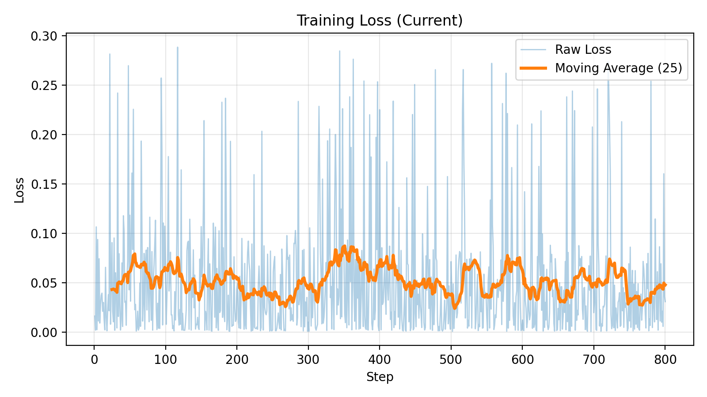
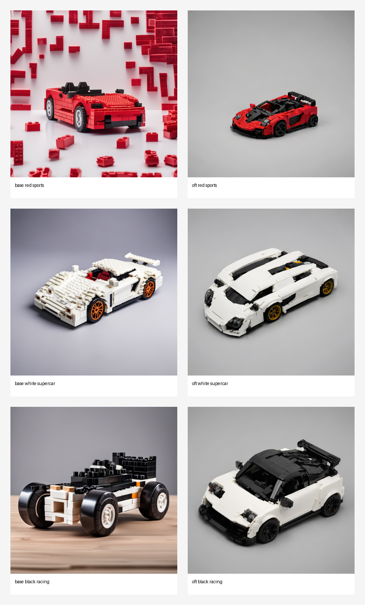
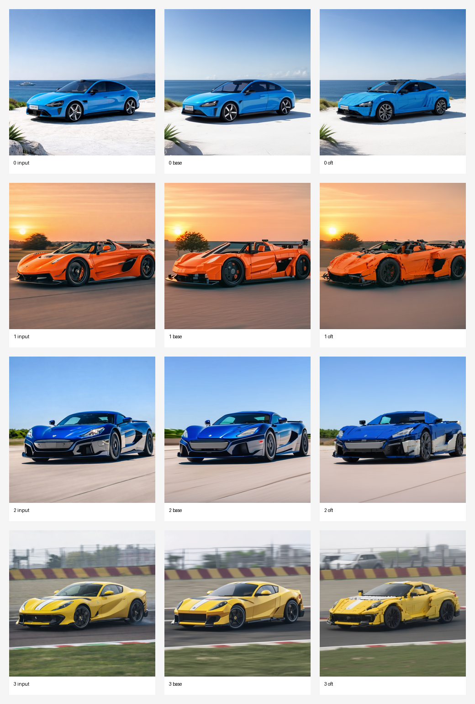

# AIST5030 Mini-Project Report: Parameter-efficient Finetuning for Pretrained Foundation Models

**Task:** LEGO-style car image generation with SDXL  
**Base model:** Stable Diffusion XL base 1.0  
**Adaptation method:** Orthogonal Finetuning (OFT)  
**Project repository:** [zzzhy03/AIST5030_MiniProgram](https://github.com/zzzhy03/AIST5030_MiniProgram)

## Abstract

This project applies Orthogonal Finetuning (OFT) to Stable Diffusion XL for LEGO-style car generation. The goal is to adapt a strong pretrained text-to-image model to a narrow visual domain in which sports cars are rendered as toy-brick builds under a clean studio setup. The final model was trained on 36 curated images for 800 optimization steps at 1024 resolution on a single NVIDIA A800-SXM4-80GB GPU. The finetuned model improved style consistency, background cleanliness, and the reliability of the `skslego` trigger token in `txt2img`, while `img2img` showed weaker but still visible gains in toy-like geometric simplification. The main remaining limitations were imperfect color control, limited viewpoint diversity, and only moderate image-guided LEGO stylization.

## 1. Task and Dataset

The downstream task is subject-driven LEGO-style car generation. The model should preserve the identity of a sports car or supercar while rendering it as a toy-brick object in a product-photo-like composition. This is a good setting for parameter-efficient finetuning because the target domain is visually narrow, while SDXL already contains strong prior knowledge about cars, lighting, and composition.

The training set contains 36 curated PNG images stored in `train_data/clean`. The images are visually consistent: they depict LEGO-style cars under relatively clean lighting and simple backgrounds. During training, each image is resized and cropped to 1024 resolution, converted to RGB, and normalized to the standard diffusion input range. The training prompt is `studio photo of a skslego sports car made of toy bricks, white seamless background`, where `skslego` is used as the learned trigger token for the target style.

## 2. Method

The project uses Stable Diffusion XL base 1.0 as the pretrained backbone and inserts OFT adapters into selected UNet modules. Instead of full finetuning, OFT modifies the pretrained backbone through structured orthogonal transformations, which reduces the adaptation scope while keeping the base model fixed. In the default setup, only the UNet is finetuned; text encoder finetuning is disabled.

The training objective is the standard SDXL denoising loss. For each batch, the VAE encodes the image into latent space, Gaussian noise is added at a sampled timestep, and the UNet predicts the target noise signal. The reported number of trainable parameters is 184,773,120. This is smaller than full end-to-end SDXL finetuning, although it is still substantial in absolute terms.

## 3. Experimental Setup

The final report uses the completed 800-step run and the exported `final_adapter` for evaluation. The main training configuration is summarized below.

| Item | Value |
|---|---|
| Training images | 36 |
| Resolution | 1024 |
| Batch size | 1 |
| Gradient accumulation | 4 |
| Max training steps | 800 |
| Learning rate | `6e-5` |
| Mixed precision | `fp16` |
| OFT rank | 8 |
| Gradient checkpointing | Enabled |
| xformers | Enabled |
| 8-bit Adam | Enabled |
| Text encoder finetuning | Disabled |

The experiment ran on a single NVIDIA A800-SXM4-80GB GPU with CUDA 13.0 and driver version 580.126.09. Observed training memory usage was about 19.5 GB, and the full run took approximately 1 hour 54 minutes including validation.

The code deliverable is available in the GitHub repository above, which includes the project README, training script, inference script, plotting utility, and report source.

## 4. Results

### 4.1 Training Loss

The training loss was noisy rather than monotonic, which is expected for diffusion training with batch size 1 and randomly sampled timesteps. Importantly, the run remained numerically stable and did not diverge. The final logged loss was 0.0309 at step 800. The average loss over the first 100 steps was about 0.0571, while the average loss over the last 100 steps was about 0.0452, indicating a mild downward trend.

### 4.2 Qualitative Results: `txt2img`

The base SDXL model can partially respond to LEGO-like prompts, but it often introduces extra loose bricks, weaker body coherence, or backgrounds that drift from the intended studio setup. After OFT finetuning, the model generates more compact toy-brick cars with cleaner composition and more stable studio backgrounds.

Three qualitative patterns are consistent across the final `txt2img` examples:

- The `skslego` token becomes a more reliable style trigger after finetuning.
- The finetuned model produces fewer unrelated floating bricks and more coherent vehicle bodies.
- Prompt following improves, although color control is still imperfect in the black-racing example.

### 4.3 Qualitative Results: `img2img`

The final `img2img` evaluation uses four held-out car photos from `testset/0.png` to `testset/3.png`. Across these examples, the finetuned model generally preserves the main car silhouette while adding slightly stronger panel segmentation and a more toy-like shape than the base model. The strongest gain appears in the yellow-car example, where the OFT result becomes visibly chunkier and more model-like.

However, the `img2img` improvements are weaker than the `txt2img` improvements. In most cases, the finetuned model remains closer to a stylized sports-car rendering than to a clearly brick-built LEGO object. This means the adapter is more convincing for prompt-based generation than for aggressive image-guided style transfer.

### 4.4 Failure Cases

The final model still shows several weaknesses:

- Color control remains imperfect; for example, the black-racing prompt produces a mostly white car with a dark roof.
- Viewpoint diversity is limited, with a bias toward familiar product-photo angles.
- `img2img` stylization is moderate rather than strong, and many outputs look toy-like rather than explicitly LEGO-built.
- Output diversity is narrow, and different prompts often converge to similar compact supercar shapes.

## 5. Discussion

The experiment shows that OFT can adapt SDXL to a narrow visual domain using a relatively small local dataset. The strongest gains are in domain consistency: after finetuning, the model is much more likely to interpret `skslego` as a compact LEGO-style sports car with a clean studio background. This is a meaningful improvement over base SDXL for the target task.

At the same time, the experiment also shows the limits of the current setup. The dataset contains only 36 images, so repeated viewpoints and repeated composition patterns are hard to avoid. In addition, although OFT is parameter-efficient relative to full finetuning, the current configuration still trains 184.8M parameters. Most importantly, `img2img` gains are real but modest, so the method works better as domain steering for `txt2img` than as a strong structure-preserving LEGO translator.

## 6. Conclusion

This project demonstrates that parameter-efficient finetuning with OFT can successfully steer SDXL toward LEGO-style car generation. The final adapter improves `txt2img` quality, produces cleaner and more coherent toy-brick cars, and makes the learned trigger token more reliable. The main remaining weaknesses are limited diversity, imperfect color control, and only moderate `img2img` stylization on a small held-out test set. Overall, the project supports OFT as a practical adaptation method for narrow visual domains, while also showing that final performance remains strongly constrained by dataset size and coverage.

## References

- Project repository: [https://github.com/zzzhy03/AIST5030_MiniProgram](https://github.com/zzzhy03/AIST5030_MiniProgram)
- Hugging Face PEFT OFT documentation: [https://huggingface.co/docs/peft/main/en/conceptual_guides/oft](https://huggingface.co/docs/peft/main/en/conceptual_guides/oft)
- Hugging Face PEFT DreamBooth/OFT example: [https://github.com/huggingface/peft/blob/main/examples/boft_dreambooth/boft_dreambooth.md](https://github.com/huggingface/peft/blob/main/examples/boft_dreambooth/boft_dreambooth.md)
